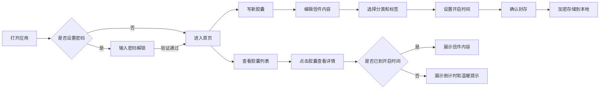

## 1. 产品概述

个人时间胶囊管理系统，一个温柔治愈的数字信箱，让用户可以给未来的自己写信，封存此刻的心情与思念，在约定的时间打开。

- 核心价值：记录当下，寄语未来，在快节奏生活中保留一份慢下来的温暖
- 目标用户：喜欢记录生活、珍视回忆、对未来有期待的每一个人
- 产品调性：温柔、治愈、精致、有温度

## 2. 核心功能

### 2.1 功能模块
1. **首页**：胶囊概览、统计数据、温暖问候
2. **写胶囊**：写信给未来的自己，设置定时开启时间
3. **胶囊分类**：按类别（梦想、亲情、友情、爱情、成长、其他）管理胶囊
4. **历史胶囊**：查看已开启的胶囊，回味过往
5. **隐私保护**：密码保护、本地加密存储

### 2.2 页面详情
| 页面名称 | 模块名称 | 功能描述 |
|-----------|-------------|---------------------|
| 首页 | 欢迎区 | 根据时间显示温暖问候语 |
| 首页 | 统计卡片 | 总胶囊数、待开启、已开启、即将开启 |
| 首页 | 胶囊列表 | 展示所有胶囊，按状态分组 |
| 写胶囊 | 编辑区 | 富文本写信，支持表情和心情标签 |
| 写胶囊 | 定时设置 | 选择开启日期，支持预设时间（1个月、1年、5年、自定义） |
| 写胶囊 | 分类选择 | 选择胶囊分类，添加标签 |
| 胶囊分类 | 分类导航 | 左侧分类筛选，右侧胶囊列表 |
| 历史胶囊 | 时间轴 | 按时间线展示已开启胶囊 |
| 胶囊详情 | 信件展示 | 优雅的信纸样式展示信件内容 |
| 隐私保护 | 密码设置 | 应用启动密码，隐私锁 |

## 3. 核心流程

## 4. 用户界面设计

### 4.1 设计风格
- **主色调**：温柔粉 (#FFE4E6)、奶油黄 (#FEF3C7)、薄荷绿 (#D1FAE5)、薰衣草紫 (#E9D5FF)
- **辅助色**：深棕灰 (#57534E)、米白 (#FAF7F2)
- **按钮风格**：圆润胶囊形，轻微阴影，hover时有柔和上浮效果
- **字体**：标题使用「Noto Serif SC」衬线字体，正文使用「Noto Sans SC」无衬线字体
- **布局风格**：卡片式设计，大量留白，柔和圆角，轻量阴影
- **图标**：线性图标，颜色柔和，搭配可爱emoji点缀
- **动效**：缓慢柔和的过渡动画，页面加载有渐入效果，胶囊卡片有呼吸感微动效

### 4.2 页面设计概述
| 页面名称 | 模块名称 | UI 元素 |
|-----------|-------------|-------------|
| 首页 | 欢迎区 | 渐变背景，温暖问候语，今日日期，装饰性云朵/星星元素 |
| 首页 | 统计卡片 | 四张柔和渐变色卡片，圆角24px，数据数字优雅排版 |
| 首页 | 胶囊列表 | 卡片流布局，每个胶囊显示状态标签、标题、分类、剩余时间 |
| 写胶囊 | 编辑区 | 信纸质感背景，横线装饰，打字时光标闪烁动画 |
| 写胶囊 | 时间选择 | 日历弹窗，预设时间快捷按钮，时间轴可视化 |
| 胶囊分类 | 分类导航 | 彩色圆形图标，点击切换有缩放动效 |
| 历史胶囊 | 时间轴 | 中间虚线连接，两侧交替排布胶囊卡片 |
| 胶囊详情 | 信件展示 | 打开信封动画，信纸展开效果，优雅的文字排版 |
| 隐私保护 | 解锁页 | 模糊背景，密码输入框，忘记密码提示 |

### 4.3 响应式
- 桌面端优先设计，最大宽度1200px居中展示
- 平板端：卡片两列布局，侧边栏折叠为顶部导航
- 移动端：单列布局，底部Tab导航，触摸优化的按钮尺寸（最小44x44px）

### 4.4 视觉细节
- 背景添加微妙的噪点纹理，避免过于光滑的数码感
- 卡片边缘添加极细的高光，模拟纸张质感
- 重要操作按钮有呼吸光效
- 空状态展示温暖的插画和鼓励文字
- 加载动画使用跳动的小心心或旋转的胶囊图标
