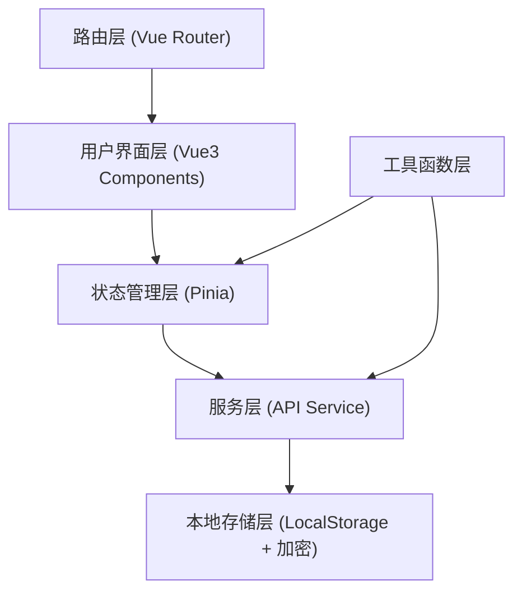
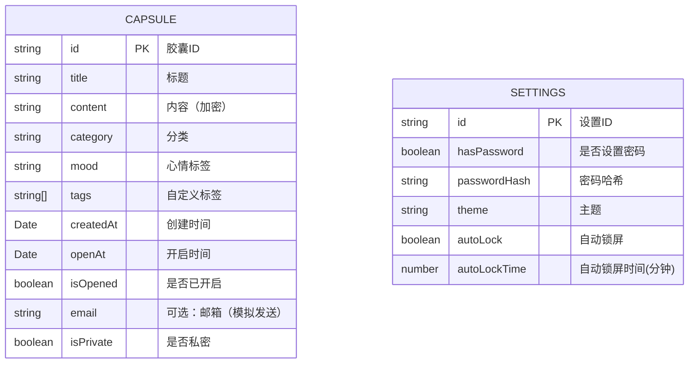

## 1. 架构设计



## 2. 技术描述

- **前端框架**：Vue@3.4 + TypeScript@5.0
- **构建工具**：Vite@5.0
- **样式方案**：Tailwind CSS@3.4
- **状态管理**：Pinia@2.1
- **路由管理**：Vue Router@4.3
- **图标库**：Lucide Vue Next
- **日期处理**：Day.js
- **本地加密**：SimpleEncrypt (自定义轻量加密)
- **数据持久化**：LocalStorage

## 3. 目录结构

```
src/
├── components/          # 公共组件
│   ├── CapsuleCard.vue      # 胶囊卡片
│   ├── CapsuleStats.vue     # 统计卡片
│   ├── CategoryIcon.vue     # 分类图标
│   ├── LetterPaper.vue      # 信纸组件
│   ├── PasswordModal.vue    # 密码弹窗
│   └── CountdownTimer.vue   # 倒计时组件
├── composables/         # 组合式函数
│   ├── useCapsules.ts       # 胶囊相关逻辑
│   ├── useEncryption.ts     # 加密相关逻辑
│   └── usePassword.ts       # 密码相关逻辑
├── pages/               # 页面组件
│   ├── Home.vue             # 首页
│   ├── WriteCapsule.vue     # 写胶囊
│   ├── Categories.vue       # 胶囊分类
│   ├── History.vue          # 历史胶囊
│   ├── CapsuleDetail.vue    # 胶囊详情
│   ├── Settings.vue         # 设置/隐私保护
│   └── LockScreen.vue       # 锁屏页
├── router/              # 路由配置
│   └── index.ts
├── stores/              # Pinia 状态管理
│   ├── capsules.ts          # 胶囊数据
│   └── settings.ts          # 设置数据
├── utils/               # 工具函数
│   ├── api.ts               # 模拟接口
│   ├── storage.ts           # 本地存储
│   ├── encrypt.ts           # 加密工具
│   └── date.ts              # 日期工具
├── types/               # 类型定义
│   └── index.ts
├── App.vue
└── main.ts
```

## 4. 路由定义

| 路由 | 页面 | 说明 |
|-------|---------|------|
| `/` | Home | 首页 - 胶囊概览 |
| `/write` | WriteCapsule | 写新胶囊 |
| `/categories` | Categories | 胶囊分类 |
| `/history` | History | 历史胶囊 |
| `/capsule/:id` | CapsuleDetail | 胶囊详情 |
| `/settings` | Settings | 设置与隐私保护 |
| `/lock` | LockScreen | 锁屏页面 |

## 5. 数据模型

### 5.1 数据定义



### 5.2 TypeScript 类型定义

```typescript
interface Capsule {
  id: string;
  title: string;
  content: string;
  category: CapsuleCategory;
  mood: MoodType;
  tags: string[];
  createdAt: Date;
  openAt: Date;
  isOpened: boolean;
  email?: string;
  isPrivate: boolean;
}

type CapsuleCategory = 'dream' | 'family' | 'friendship' | 'love' | 'growth' | 'other';
type MoodType = 'happy' | 'sad' | 'peaceful' | 'excited' | 'grateful' | 'confused';

interface Settings {
  id: string;
  hasPassword: boolean;
  passwordHash: string;
  theme: 'soft' | 'warm' | 'cool';
  autoLock: boolean;
  autoLockTime: number;
}

interface CapsuleStats {
  total: number;
  pending: number;
  opened: number;
  comingSoon: number;
}
```

## 6. 模拟接口 (API)

### 6.1 胶囊相关接口

```typescript
// 获取所有胶囊
GET /api/capsules → Promise<Capsule[]>

// 获取单个胶囊
GET /api/capsules/:id → Promise<Capsule>

// 创建胶囊
POST /api/capsules → Promise<Capsule>

// 更新胶囊
PUT /api/capsules/:id → Promise<Capsule>

// 删除胶囊
DELETE /api/capsules/:id → Promise<boolean>

// 获取胶囊统计
GET /api/capsules/stats → Promise<CapsuleStats>

// 按分类获取胶囊
GET /api/capsules/category/:category → Promise<Capsule[]>

// 获取历史胶囊（已开启）
GET /api/capsules/history → Promise<Capsule[]>

// 模拟定时发送检查
POST /api/capsules/check-scheduled → Promise<Capsule[]>
```

### 6.2 设置相关接口

```typescript
// 获取设置
GET /api/settings → Promise<Settings>

// 更新设置
PUT /api/settings → Promise<Settings>

// 验证密码
POST /api/settings/verify-password → Promise<boolean>

// 设置密码
POST /api/settings/set-password → Promise<boolean>
```

## 7. 核心功能实现思路

### 7.1 加密存储
- 使用轻量的 XOR 加密 + Base64 编码存储胶囊内容
- 密码使用 SHA-256 哈希存储（加盐）
- 所有敏感数据在写入 LocalStorage 前加密

### 7.2 定时发送（模拟）
- 应用启动时检查所有待开启胶囊
- 对比当前时间与开启时间，更新胶囊状态
- 使用 `setInterval` 每分钟检查一次
- 即将到期的胶囊显示提醒

### 7.3 隐私保护
- 可设置应用启动密码
- 支持自动锁屏（5/10/30分钟）
- 私密胶囊需额外验证密码才能查看

### 7.4 动效实现
- 使用 Vue Transition 组件实现页面切换动画
- CSS Keyframes 实现呼吸、浮动等微动效
- 交互反馈使用轻微的 transform + opacity 过渡
